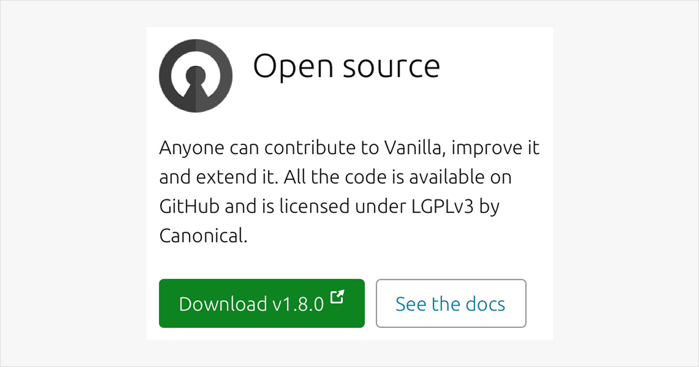
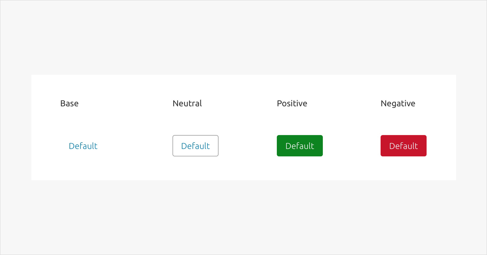
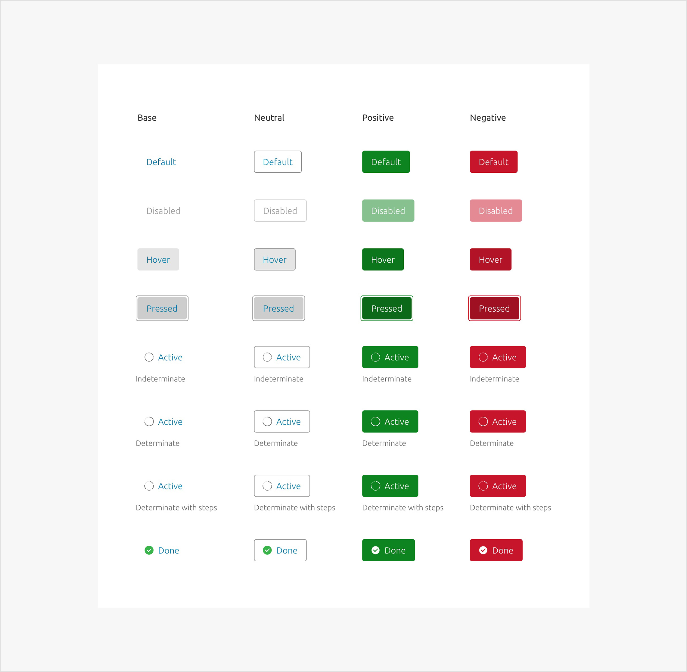
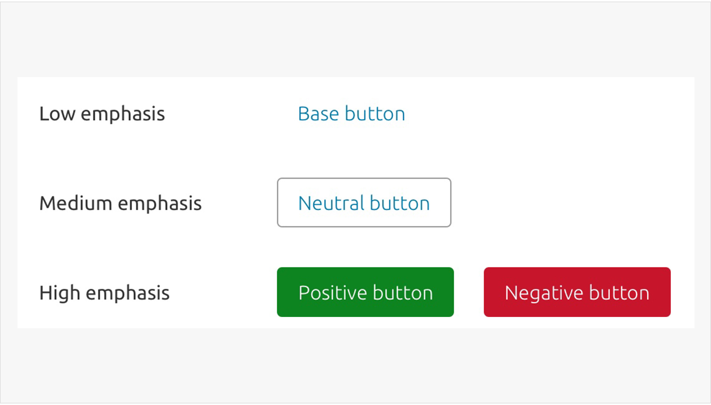
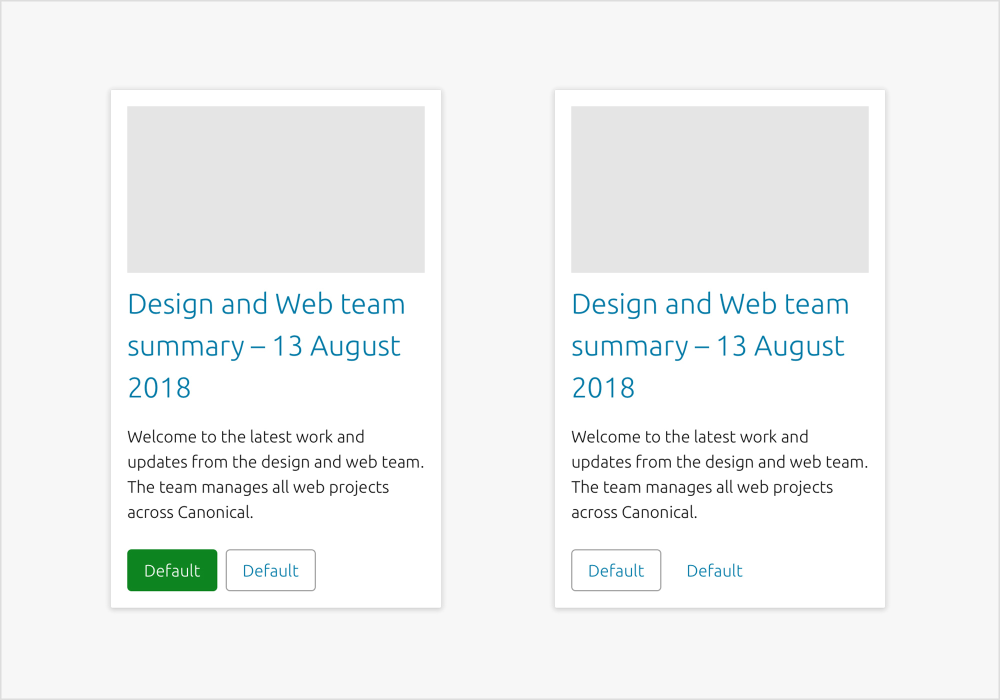

	

	  

	    <h2 id="our-sass-framework">Buttons</h2>
	    
Buttons describe an action that will occur when the user clicks or taps it. They can also give actions different levels of emphasis within the UI.

			
			Sample of buttons in context
	  

	

  

    

      <h2 id="our-work-practices">Usage</h2>
      
Buttons can be used in many places and contexts, for example:

      <ul class="p-list">
        <li class="p-list__item is-ticked">Forms</li>
				<li class="p-list__item is-ticked">Tables views</li>
				<li class="p-list__item is-ticked">Cards</li>
				<li class="p-list__item is-ticked">Modal windows</li>
				<li class="p-list__item is-ticked">Dialogs</li>
      </ul>
    

  

  

    

      <h2 id="our-work-practices">Types</h2>
      
We have four different button types, to use for different levels of emphasis.

      <ul class="p-list">
        <li class="p-list__item is-ticked">Neutral</li>
				<li class="p-list__item is-ticked">Positive</li>
				<li class="p-list__item is-ticked">Negative</li>
				<li class="p-list__item is-ticked">The above with animation / icons</li>
				<li class="p-list__item is-ticked">The above at large and small sizes</li>
      </ul>
			
			Types of buttons
			 
			
			States of buttons
    

  

  

    

      <h2 id="our-work-practices">Hierarchy</h2>
      
Our buttons are designed to be used with other UI elements to give different levels of visual emphasis.

			<ul class="p-list">
        <li class="p-list__item is-ticked">High emphasis</li>
				<li>Positive button</li>
				<li>Negative button</li>
        <li class="p-list__item is-ticked">Medium emphasis</li>
				<li>Neutral button</li>
        <li class="p-list__item is-ticked">Low emphasis</li>
				<li>Base button</li>
			</ul>
			
			Example of hierarchy among buttons
    

  

  

    

      <h2 id="our-work-practices">Grouping</h2>
			<ul class="p-list">
        <li class="p-list__item is-ticked">Positive</li>
				<li>Try to only use one positive or negative button per page if the content allows. This will help the user to understand the main purpose of the page and the required action.</li>
        <li class="p-list__item is-ticked">Positive and neutral</li>
				<li>If a positive or negative button requires a supporting action the neutral button should be used</li>
        <li class="p-list__item is-ticked">Positive and base</li>
				<li>If the supporting action does not require the prominence given by a neutral button, the base style can be used.</li>
				<li class="p-list__item is-ticked">Neutral and base</li>
				<li>This combination should be used on pages where a positive or negative button has already been used, on pages with many buttons, or on pages where prominence is less important.</li>
			</ul>
			 
			
			Example of hierarchy among buttons
    

  

  

    

      <h2>Links</h2>
			
<a href="https://docs.vanillaframework.io/en/patterns/buttons">Vanilla Docs for buttons</a>

      
<a href="#" class="p-button--brand">Download the Sketch file</a>

    

  

